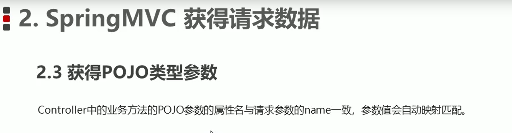

# SpringMVC

## 1.开发步骤

1.导入springMVC包--坐标

2.配置共有servlet--DispatherServlet 前端控制器

3.编写Controller

4.将Controller使用注解配置到spring容器种（@Controller）--web层

5.开启注解组件扫描--- 配置spring-mvc.xml

6.执行访问测试

2.  

3.   编写UserController

   

4. spring-mvc

   

5. 引入spring-mvc xml 

   

6. 测试 在地址输入@RequestMapping中的名字，就能执行对应的方法

**流程图**：

##  2.springMvc组件解析

method  = Requestmethod.get/post

--------------------------------

 

加   **/**   的意思===当前目录下的资源

###  资源解析器？？

## 3.SpringMVC的数据响应

  

Model:模型 封装数据

View:视图 展示数据 

RequestMappint(value="/路径")

在jsp中${username}

##  4.文件上传

##  5.拦截器

##  6.异常

、

##  spring练习

