#  spring5框架

结构

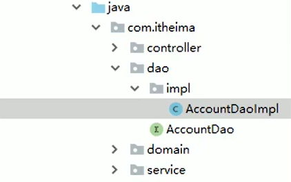

##  1.ioc

配置文件

###  1.1 概念和原理

### 1.2 接口

###  1.3 ioc操作Bean管理(xml管理)

1.什么是Bean管理

​    Bean管理指的是两个操作：（1）Spring创建对象 （2）SPring注入属性

2.Bean管理操作有两种方式

  （1）基于xml配置文件方式实现

  （2）基于注解方式实现

<b>            先创建对象再注入属性</b>

2.注入属性-外部bean

   <b>xml文件</b>

3.注入属性-内部bean和级联赋值

（3）配置spring文件

级联赋值

4.xml注入属性集合

1.数组

2.list类型

3.map类型

对象注入list集合

使用util标签完成list集合注入提取

Bean的作用域

默认单实例，scope=“singleton"默认单实例  prototype=多实例 

自动装配

配置连接池

引用外部配置信息

###  1.4 ioc操作Bean管理(注解管理)

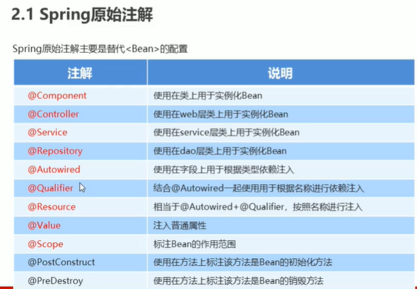

组件扫描的细节配置

一个接口有多个实现类，如果根据类型注入，会导致多态无法有效使用，所以用到Qualifier根据名称注入，这个方法要和Autowired一起使用

 

 ###  1.5 完全注解开发

相当于spring boot

## 2. AOP

### 2.1 概念

### 2.2 底层原理

 

 使用jdk动态代理 Proxy类

编写JDK动态代理代码

  P27 代码编写

### 2.3 术语

 1.连接点

​	类里面那些方法可以被增强，这些方法称为连接点

2.切入点

​	实际被真正增强的方法，称为切入点

3.通知（增强）

​	（1）实际增强的逻辑部分称为通知（增强）

​	（2）通知有多种类型

4.切面

### 2.4 操作（准备）

 

*中间有个空格==所有权限符

..代表所有参数

###  2.5Aspect（注解）

（1）

（2）

（3）

（4）

意思就是扫描有没有@Aspect类的对象，有就开启

**PS**：

### 2.6 AspectJ配置文件（了解）

##  3.数据源

### 3.1 配置数据源

1.导入包

2.导入坐标

### 3.2 抽取数据源

jdbc.properties

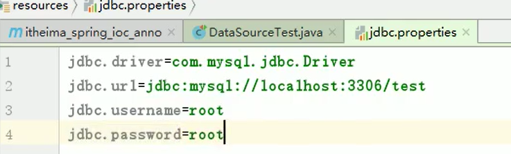

C3P0数据源

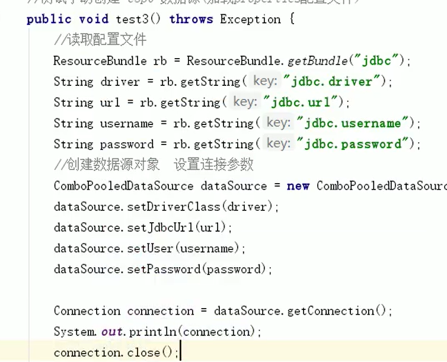

方便解耦

###  3.3 spring配置数据源（c3p0）

xml文件 

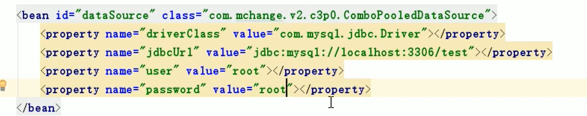

property的name 就是set方法的头字母小写

**测试**

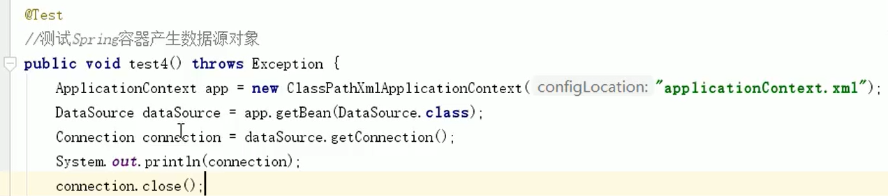

如果要配置druid的话 property要注意name的名字

### 3.4 jdbcTemplate

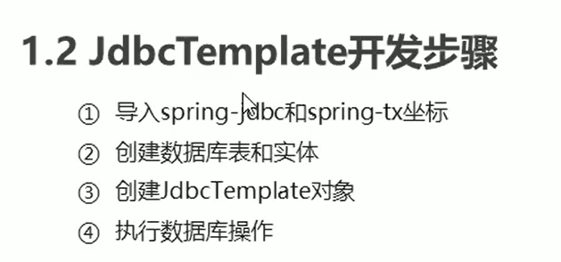

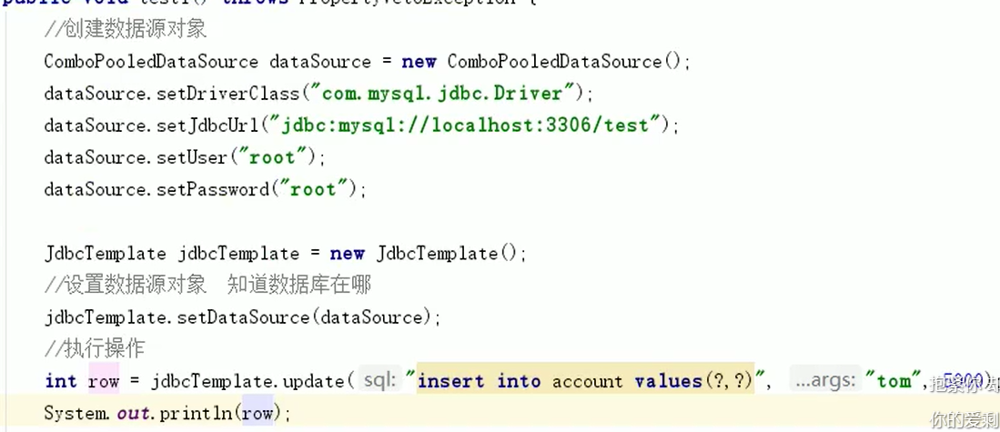

###  3.5 spring产生jdbcTemplate对象

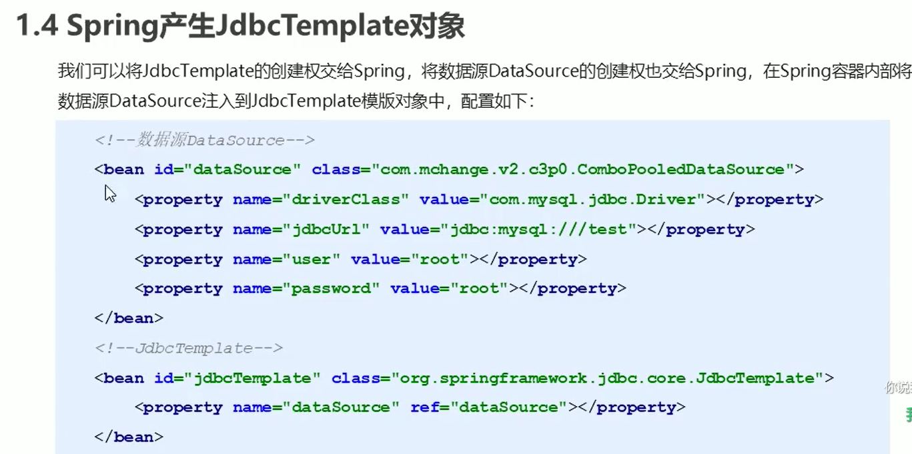

spring代码：

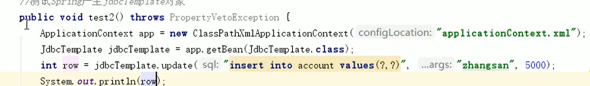

模板：

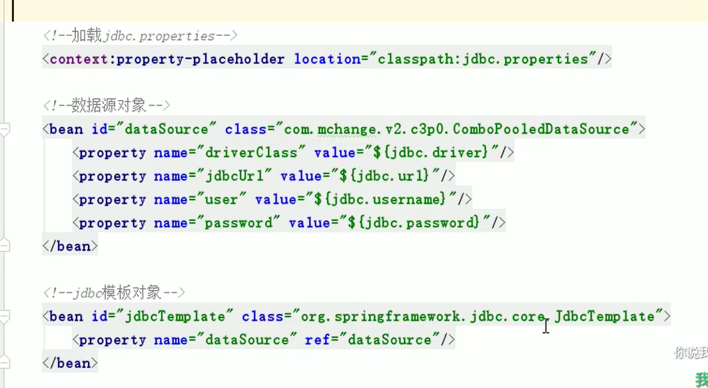

省略

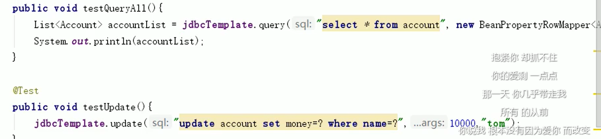

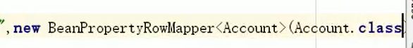

jdbcTemplate.query（sql，new BeanPropertRowMapper<T>(类的字节码))

T代表封装的实体类

**单个查询**，queryForObjcet(sql=?，new BeanPropertRowMapper<T>(类的字节码),属性)

**聚合查询，**

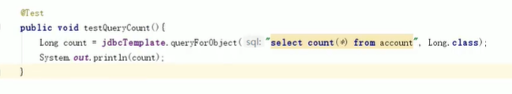

###  3.6 知识要点

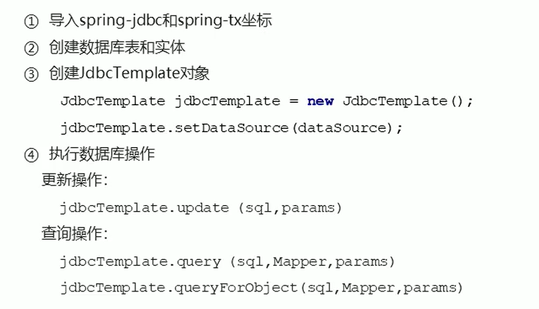

jdbcTemplate new完之后要注入数据源才能用

##  4.事务控制-编程式

###  4.1 PlatformTransactionManger

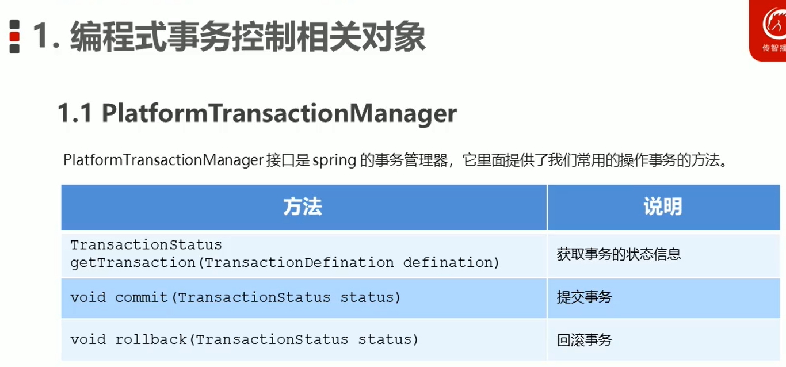

###  4.2 TransactionDefinition

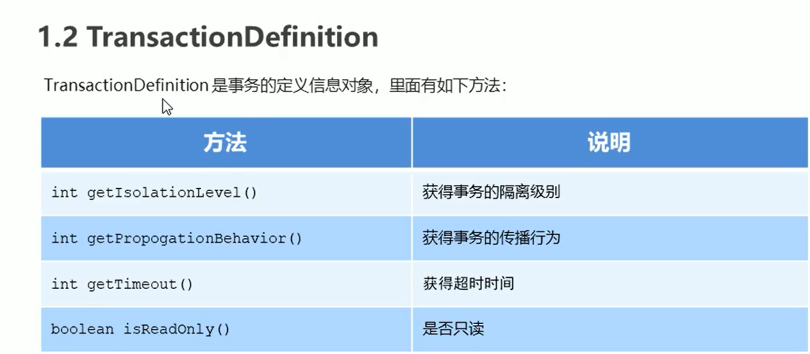

### 4.3 TransactionStatus

## 5. 基于XML的声明式事务控制

###  5.1 声明式事务控制的实现

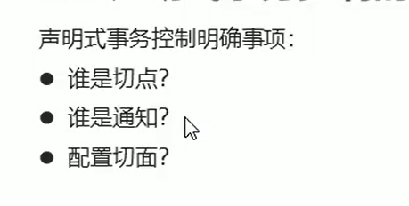

切点---目标对象就是切点 例如转账

通知--事务的增强 

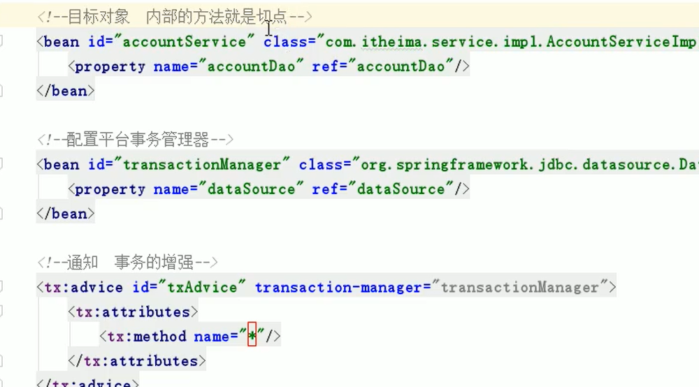

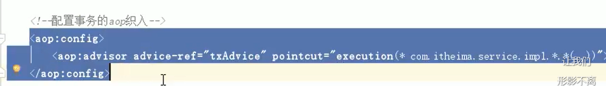

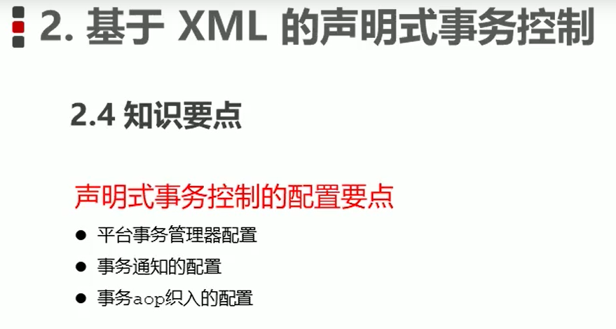

## 6. 基于注解的声明式事务控制

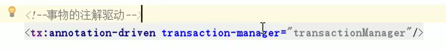

##  Spring集成web环境

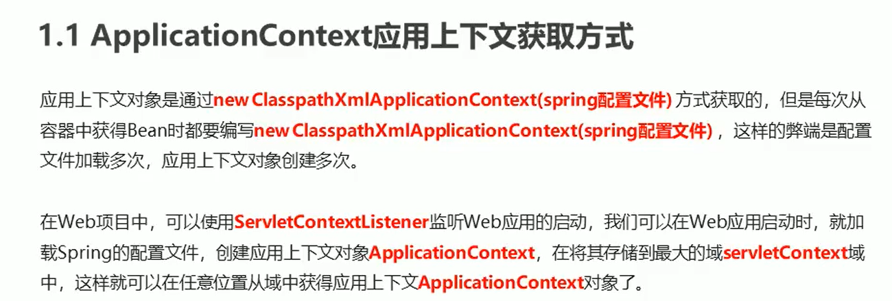

监听器：

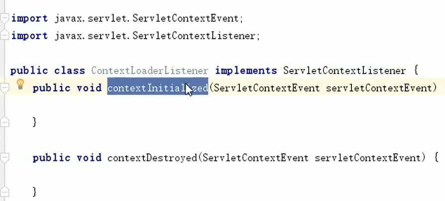

1 配置监听器 web/xml 

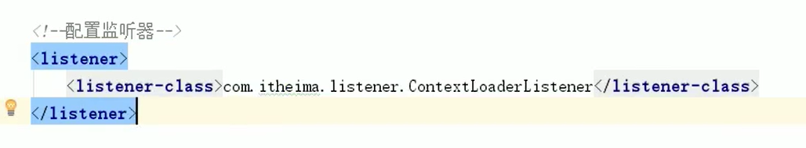

获取：在doget或post

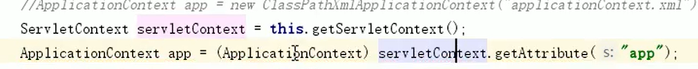

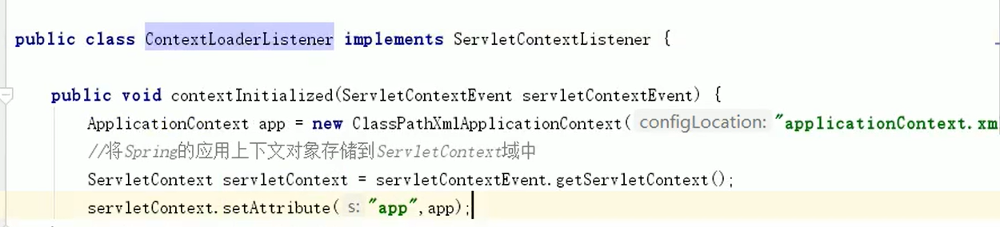

在web xml里面取代 获取应用上下文 方便更改名字

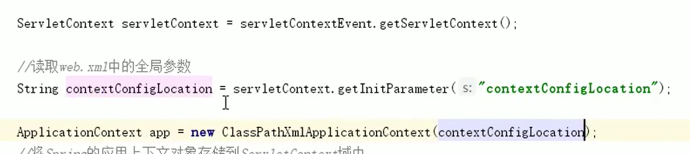

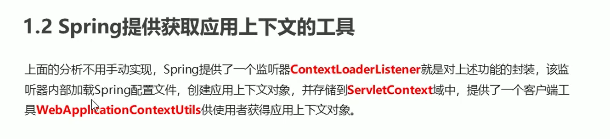

这是spring提供的监听器

**使用方法**：

 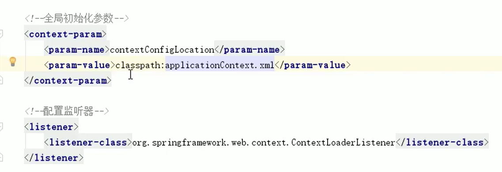

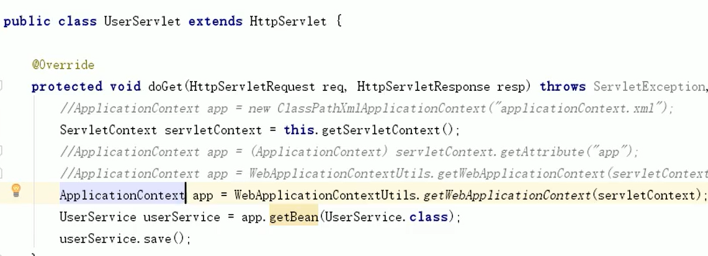

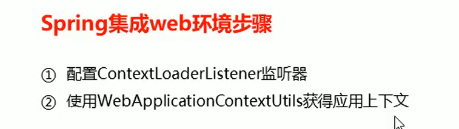

