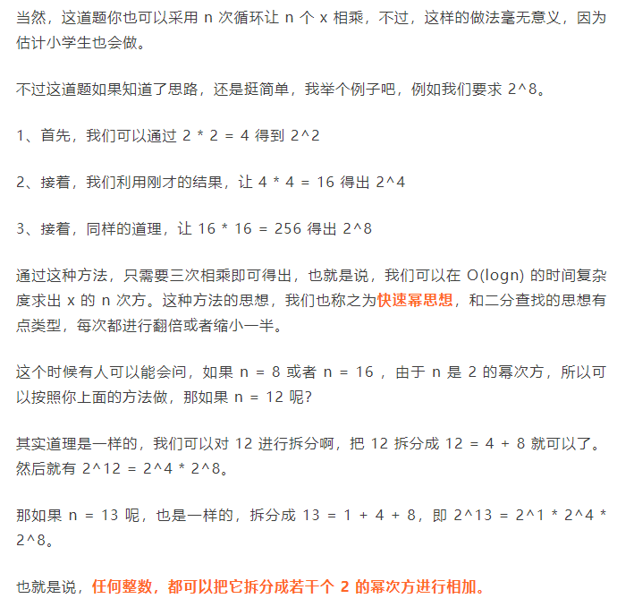
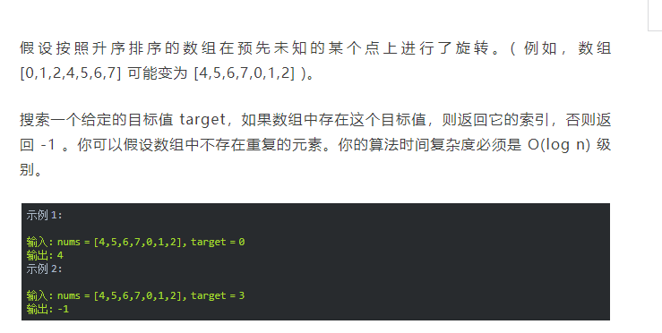

#  每天一积累

##  2021/3/7 什么是B树？为啥文件索引要用B树而不用二叉查找树？

B树就是一棵多叉查找树，对于一棵 m 阶的 B 树具有如下特性：

1、根节点至少有两个孩子。

2、每个中间节点都包含 k - 1 个元素和 k 个孩子，其中 m/2 <= k <= m。

3、每一个叶子节点都包含 k - 1 个元素，其中 m/2 <= k <= m。

4、所有的叶子节点都位于同一侧。

5、每个节点中的元素从小到大排列，节点当中的 k - 1 个元素正好是 k 个孩子包含的元素的值域划分。


​      因为二叉查找树节点在内存中是不连续的，如果单单从比较次数来看，B树和二叉查找树有可能比较次数相同，但是从性能上来说，数据都存放在磁盘里面，所以我们要考虑到磁盘的寻址次数。 我们知道，在把磁盘里的数据加载到内存中的时候，是以**页**为单位来加载的，而我们也知道，**节点与节点之间的数据是不连续的**，所以不同的节点，很有可能分布在不同的**磁盘页**中 。

​      还有在内存的运算速度是非常快的，至少比磁盘的寻址加载速度，快了几百倍，而我们进行数值比较的时候，是在内存中进行的，虽然 B 树的比较次数可能比二叉查找树多，但是**磁盘操作次数少**，所以总体来说，还是 B 树快的多，这也是为什么我们用使用 B 树来存储的原因。 

   最后： B 树除了会用在少部分的文件索引（数据库索引）外，应用的最多的就是**文件系统**了。  大部分文件索引或者数据库索引都是用 **B+ 树**的，而只有小部分才用 B 树 。

##  2021/3/8 为什么MySQL数据库要用B+树存储索引？

B+树是在B树的基础上进行改造的，它的数据都在叶子结点，同时叶子结点之间还加了指针形成链表。


**为什么要这样设计呢？**因为这样设计，数据就全在叶子结点上。


如果只选一个数据，那么hash比b+树快。但是数据库中经常会选择多条，这时候由于B+树索引有序，并且又要链表相连，它的查询效率就比hash快很多。而且数据库中的索引一般是在磁盘上，数据量大的情况可能无法一次装入内存，B+树的设计可以允许数据分批加载，同时树的高度较低，提高查找效率。 

## 2021/3/9 有了二叉查找树、平衡树为啥还需要红黑树？

二叉查找树的特点： 就是**左子树的节点值比父亲节点小，而右子树的节点值比父亲节点** 。

 基于二叉查找树的这种特点，我们在查找某个节点的时候，可以采取类似于**二分查找**的思想，快速找到某个节点。n 个节点的二叉查找树，正常的情况下，查找的时间复杂度为 O（logn）。 

 之所以说是**正常情况下**，是因为二叉查找树有可能出现一种极端的情况，例如 

 这种情况也是满足**二叉查找树**的条件，然而，此时的二叉查找树已经近似退化为一条链表，这样的二叉查找树的查找时间复杂度顿时变成了 O(n)，可想而知，我们必须不能让这种情况发生，为了解决这个问题，于是我们引申出了**平衡二叉树**。 

平衡二叉树就是为了解决二叉查找树退化成一条链表而诞生的，它的特点是：

1、具有二叉查找树的全部特性。

2、每个节点的左子树和右子树的高度差至多等于1。


 对于图二，因为节点9的左孩子高度为2，而右孩子高度为0。他们之间的差值超过1了。  平衡树基于这种特点就可以保证不会出现大量节点偏向于一边的情况了。 

 于是，通过平衡树，我们解决了二叉查找树的缺点。对于有 n 个节点的平衡树，最坏的查找时间复杂度也为 O(logn)。 而不会退化成一条链表。


**为什么有了平衡树还需要红黑树呢**？

虽然平衡树解决了二叉查找树退化为近似链表的缺点，能够把查找时间控制在 O(logn)，不过却不是最佳的，因为平衡树要求**每个节点的左子树和右子树的高度差至多等于1**，这个要求实在是太严了，导致每次进行插入/删除节点的时候，几乎都会破坏平衡树的第二个规则，进而我们都需要通过**左旋**和**右旋**来进行调整，使之再次成为一颗符合要求的平衡树。

显然，如果在那种插入、删除很频繁的场景中，平衡树需要频繁着进行调整，这会使平衡树的性能大打折扣，为了解决这个问题，于是有了**红黑树**，红黑树具有如下特点：

**1、具有二叉查找树的特点。**

**2、根节点是黑色的；**

**3、每个叶子节点都是黑色的空节点（NIL），也就是说，叶子节点不存数据。**

**4、任何相邻的节点都不能同时为红色，也就是说，红色节点是被黑色节点隔开的。**

**5、每个节点，从该节点到达其可达的叶子节点是所有路径，都包含相同数目的黑色节点。**

 正是由于红黑树的这种特点，使得它能够在最坏情况下，也能在 O(logn) 的时间复杂度查找到某个节点。 

 不过，与平衡树不同的是，红黑树在插入、删除等操作，**不会像平衡树那样，频繁着破坏红黑树的规则，所以不需要频繁着调整**，这也是我们为什么大多数情况下使用红黑树的原因。 

 单单在查找方面的效率的话，平衡树比红黑树快。 


总结： 平衡树是为了解决二叉查找树退化为链表的情况，而红黑树是为了解决平衡树在插入、删除等操作需要频繁调整的情况。 


##  2021/3/10关于三次握手与四次挥手面试官想考我们什么？

**三次握手**：可以验证客户端和服务器双方的发送和接收功能是否正常

第一次握手： 客户端发送网络包，服务端收到了。这样服务端就能得出结论：客户端的发送能力、服务端的接收能力是正常的。 

第二次握手：服务端发包，客户端收到了。这样客户端就能得出结论：服务端的接收、发送能力，客户端的接收、发送能力是正常的。不过此时服务器并不能确认客户端的接收能力是否正常。   

第三次握手：客户端发包，服务端收到了。这样服务端就能得出结论：客户端的接收、发送能力正常，服务器自己的发送、接收能力也正常。

 因此，需要三次握手才能确认双方的接收与发送能力是否正常。 

更加详细的话：

1、第一次握手：客户端给服务端发一个 SYN 报文，并指明客户端的初始化序列号 **ISN(c)**。此时客户端处于 **SYN_Send** 状态。

2、第二次握手：服务器收到客户端的 SYN 报文之后，会以自己的 SYN 报文作为应答，并且也是指定了自己的初始化序列号 ISN(s)，同时会把客户端的 ISN + 1 作为 ACK 的值，表示自己已经收到了客户端的 SYN，此时服务器处于 **SYN_REVD** 的状态。

3、第三次握手：客户端收到 SYN 报文之后，会发送一个 ACK 报文，当然，也是一样把服务器的 ISN + 1 作为 ACK 的值，表示已经收到了服务端的 SYN 报文，此时客户端处于 **establised**（**以连接**） 状态。

4、服务器收到 ACK 报文之后，也处于 **establised 状态**，此时，双方以建立起了链接。

**三次握手的作用**

三次握手的作用也是有好多的，多记住几个，保证不亏。例如：

1、确认双方的接受能力、发送能力是否正常。

2、指定自己的初始化序列号，为后面的可靠传送做准备。

3、如果是 https 协议的话，三次握手这个过程，还会进行数字证书的验证以及加密密钥的生成到。


**关于三次握手的问题？**

**1、（ISN）是固定的吗**

三次握手的一个重要功能是客户端和服务端交换ISN(Initial Sequence Number), 以便让对方知道接下来接收数据的时候如何按序列号组装数据。

如果ISN是固定的，攻击者很容易猜出后续的确认号，因此 ISN 是动态生成的。

**2、什么是半连接队列**

服务器第一次收到客户端的 SYN 之后，就会处于 SYN_RCVD 状态，此时双方还没有完全建立其连接，服务器会把此种状态下请求连接放在一个队列里，我们把这种队列称之为**半连接队列**。当然还有一个**全连接队列**，就是已经完成三次握手，建立起连接的就会放在全连接队列中。如果队列满了就有可能会出现丢包现象。


**3、三次握手过程中可以携带数据吗**

很多人可能会认为三次握手都不能携带数据，其实第三次握手的时候，是可以携带数据的。也就是说，第一次、第二次握手不可以携带数据，而第三次握手是可以携带数据的。

为什么这样呢？大家可以想一个问题，假如第一次握手可以携带数据的话，如果有人要恶意攻击服务器，那他每次都在第一次握手中的 SYN 报文中放入大量的数据，因为攻击者根本就不理服务器的接收、发送能力是否正常，然后疯狂着重复发 SYN 报文的话，这会让服务器花费很多时间、内存空间来接收这些报文。也就是说，第一次握手可以放数据的话，其中一个简单的原因就是会让服务器更加容易受到攻击了。

而对于第三次的话，此时客户端已经处于 established 状态，也就是说，对于客户端来说，他已经建立起连接了，并且也已经知道服务器的接收、发送能力是正常的了，所以能携带数据页没啥毛病。


**四次挥手**

刚开始双方都处于 establised 状态，假如是客户端先发起关闭请求，则：

1、第一次挥手：客户端发送一个 FIN 报文，报文中会指定一个序列号。此时客户端处于**CLOSED_WAIT1**状态。

2、第二次挥手：服务端收到 FIN 之后，会发送 ACK 报文，且把客户端的序列号值 + 1 作为 ACK 报文的序列号值，表明已经收到客户端的报文了，此时服务端处于 **CLOSE_WAIT2**状态。

这时客户端已经确定自己不需要再发送数据给服务器了，但这个时候服务器可能还有没发完的数据给客户端，所以服务器现在还是可以发送数据给客户端的，如果服务器已经没有数据发送的时候，就进行第三次挥手。

 3、第三次挥手：如果服务端也想断开连接了，和客户端的第一次挥手一样，发给 FIN 报文，且指定一个序列号。此时服务端处于 **LAST_ACK** 的状态。 

 4、第四次挥手：客户端收到 FIN 之后，一样发送一个 ACK 报文作为应答，且把服务端的序列号值 + 1 作为自己 ACK 报文的序列号值，此时客户端处于 **TIME_WAIT** 状态。需要过一阵子以确保服务端收到自己的 ACK 报文之后才会进入 CLOSED 状态 

 5、服务端收到 ACK 报文之后，就处于关闭连接了，处于 CLOSED 状态。 


这里特别需要主要的就是**TIME_WAIT**这个状态了，这个是面试的高频考点，就是要理解，为什么客户端发送 ACK 之后不直接关闭，而是要等一阵子才关闭。这其中的原因就是，要确保服务器是否已经收到了我们的 ACK 报文，如果没有收到的话，服务器会重新发 FIN 报文给客户端，客户端再次收到 FIN 报文之后，就知道之前的 ACK 报文丢失了，然后再次发送 ACK 报文。

至于 TIME_WAIT 持续的时间至少是一个报文的来回时间。一般会设置一个计时，如果过了这个计时没有再次收到 FIN 报文，则代表对方成功就是 ACK 报文，此时处于 CLOSED 状态。


##  2021/3/11 堆排序

代码：

 

```java
public class HeapSort {
  */**
  \*  下沉操作，执行删除操作相当于把最后
  \*  \* 一个元素赋给根元素之后，然后对根元素执行下沉操作
  \* @param arr
  \* @param parent 要下沉元素的下标
  \* @param length 数组长度
  \*/*
  public static int[] downAdjust(int[] arr, int parent, int length) {
    *//临时保证要下沉的元素*
    int temp = arr[parent];
    *//定位左孩子节点位置*
    int child = 2 * parent + 1;
    *//开始下沉*
    while (child < length) {
      *//如果右孩子节点比左孩子小，则定位到右孩子*
      if (child + 1 < length && arr[child] > arr[child + 1]) {
        child++;
      }
      *//如果父节点比孩子节点小或等于，则下沉结束*
      if (temp <= arr[child])
        break;
      *//单向赋值*
      arr[parent] = arr[child];
      parent = child;
      child = 2 * parent + 1;
    }
    arr[parent] = temp;
    return arr;
  }

  *//堆排序*
  public static int[] heapSort(int[] arr, int length) {
    *//构建二叉堆*
    for (int i = (length - 2) / 2; i >= 0; i--) {
      arr = downAdjust(arr, i, length);
    }
    *//进行堆排序*
    for (int i = length - 1; i >= 1; i--) {
      *//把堆顶的元素与最后一个元素交换*
      int temp = arr[i];
      arr[i] = arr[0];
      arr[0] = temp;
      *//下沉调整*
      arr = downAdjust(arr, 0, i);
    }
    return arr;
  }
  *//测试*
  public static void main(String[] args) {
    int[] arr = new int[]{1, 3, 5,2, 0,10,6};
    System.out.println(Arrays.toString(arr));
    arr = heapSort(arr, arr.length);
    System.out.println(Arrays.toString(arr));
  }
} 
```

如果用一个辅助数组来进行堆排序，那么每次从堆顶删除元素，最后辅助数组就是一个从小到大的数组。

##  PS c++头文件

```c++
#include<bits/stdc++.h>//包含所有头文件
using namespace std;

int main(){

    return 0;

}
```

##  2021/3/12 求 x 的 n 次方、搜索旋转排序数组

**1.求x的n次方**

快速幂方法：

```c
 int pow(int x, int n){
  int res = 1;
  while(n > 0){
    if(n % 2 == 1){
      res *= x;
    }
    n >> 1;
    x = x * x;
  }
} 
```

**2.搜索旋转排序数组**



```c++
 int rotatedBinarySearch(int[] arr, int target){
  // 最左侧元素下标
  int left = 0;
  // 最右侧元素下标
  int right = arr.length - 1;
  while(left <= right){
    // 中间元素下标
    int mid = left + (right - left) / 2;
    if(arr[mid] == target){
      return mid;
    }

​    // 情况1：如果中间元素在旋转点左侧
​    if(arr[mid] >= arr[left]){
​      //target 如果位于中间元素的左侧
​      if(arr[mid] > target && target >= arr[left]){
​        right = mid - 1;
​      }else{
​        left = mid + 1;
​      }
​    }
​    // 情况2：中间元素在旋转点的右侧
​    else{
      // target 如果位于中间元素的右侧
​      if(arr[mid] < target && target <= arr[right]){
​        left = mid + 1;
​      }else{
​        right = mid - 1;
​      }
​    }
  }
  return -1;
} 
```

