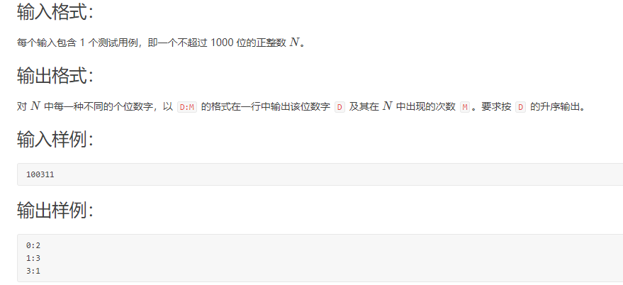

#  每天一积累

##  2021/3/7 什么是B树？为啥文件索引要用B树而不用二叉查找树？

B树就是一棵多叉查找树，对于一棵 m 阶的 B 树具有如下特性：

1、根节点至少有两个孩子。

2、每个中间节点都包含 k - 1 个元素和 k 个孩子，其中 m/2 <= k <= m。

3、每一个叶子节点都包含 k - 1 个元素，其中 m/2 <= k <= m。

4、所有的叶子节点都位于同一侧。

5、每个节点中的元素从小到大排列，节点当中的 k - 1 个元素正好是 k 个孩子包含的元素的值域划分。


​      因为二叉查找树节点在内存中是不连续的，如果单单从比较次数来看，B树和二叉查找树有可能比较次数相同，但是从性能上来说，数据都存放在磁盘里面，所以我们要考虑到磁盘的寻址次数。 我们知道，在把磁盘里的数据加载到内存中的时候，是以**页**为单位来加载的，而我们也知道，**节点与节点之间的数据是不连续的**，所以不同的节点，很有可能分布在不同的**磁盘页**中 。

​      还有在内存的运算速度是非常快的，至少比磁盘的寻址加载速度，快了几百倍，而我们进行数值比较的时候，是在内存中进行的，虽然 B 树的比较次数可能比二叉查找树多，但是**磁盘操作次数少**，所以总体来说，还是 B 树快的多，这也是为什么我们用使用 B 树来存储的原因。 

   最后： B 树除了会用在少部分的文件索引（数据库索引）外，应用的最多的就是**文件系统**了。  大部分文件索引或者数据库索引都是用 **B+ 树**的，而只有小部分才用 B 树 。

##  2021/3/8 为什么MySQL数据库要用B+树存储索引？

B+树是在B树的基础上进行改造的，它的数据都在叶子结点，同时叶子结点之间还加了指针形成链表。


**为什么要这样设计呢？**因为这样设计，数据就全在叶子结点上。


如果只选一个数据，那么hash比b+树快。但是数据库中经常会选择多条，这时候由于B+树索引有序，并且又要链表相连，它的查询效率就比hash快很多。而且数据库中的索引一般是在磁盘上，数据量大的情况可能无法一次装入内存，B+树的设计可以允许数据分批加载，同时树的高度较低，提高查找效率。 

## 2021/3/9 有了二叉查找树、平衡树为啥还需要红黑树？

二叉查找树的特点： 就是**左子树的节点值比父亲节点小，而右子树的节点值比父亲节点** 。

 基于二叉查找树的这种特点，我们在查找某个节点的时候，可以采取类似于**二分查找**的思想，快速找到某个节点。n 个节点的二叉查找树，正常的情况下，查找的时间复杂度为 O（logn）。 

 之所以说是**正常情况下**，是因为二叉查找树有可能出现一种极端的情况，例如 

 这种情况也是满足**二叉查找树**的条件，然而，此时的二叉查找树已经近似退化为一条链表，这样的二叉查找树的查找时间复杂度顿时变成了 O(n)，可想而知，我们必须不能让这种情况发生，为了解决这个问题，于是我们引申出了**平衡二叉树**。 

平衡二叉树就是为了解决二叉查找树退化成一条链表而诞生的，它的特点是：

1、具有二叉查找树的全部特性。

2、每个节点的左子树和右子树的高度差至多等于1。


 对于图二，因为节点9的左孩子高度为2，而右孩子高度为0。他们之间的差值超过1了。  平衡树基于这种特点就可以保证不会出现大量节点偏向于一边的情况了。 

 于是，通过平衡树，我们解决了二叉查找树的缺点。对于有 n 个节点的平衡树，最坏的查找时间复杂度也为 O(logn)。 而不会退化成一条链表。


**为什么有了平衡树还需要红黑树呢**？

虽然平衡树解决了二叉查找树退化为近似链表的缺点，能够把查找时间控制在 O(logn)，不过却不是最佳的，因为平衡树要求**每个节点的左子树和右子树的高度差至多等于1**，这个要求实在是太严了，导致每次进行插入/删除节点的时候，几乎都会破坏平衡树的第二个规则，进而我们都需要通过**左旋**和**右旋**来进行调整，使之再次成为一颗符合要求的平衡树。

显然，如果在那种插入、删除很频繁的场景中，平衡树需要频繁着进行调整，这会使平衡树的性能大打折扣，为了解决这个问题，于是有了**红黑树**，红黑树具有如下特点：

**1、具有二叉查找树的特点。**

**2、根节点是黑色的；**

**3、每个叶子节点都是黑色的空节点（NIL），也就是说，叶子节点不存数据。**

**4、任何相邻的节点都不能同时为红色，也就是说，红色节点是被黑色节点隔开的。**

**5、每个节点，从该节点到达其可达的叶子节点是所有路径，都包含相同数目的黑色节点。**

 正是由于红黑树的这种特点，使得它能够在最坏情况下，也能在 O(logn) 的时间复杂度查找到某个节点。 

 不过，与平衡树不同的是，红黑树在插入、删除等操作，**不会像平衡树那样，频繁着破坏红黑树的规则，所以不需要频繁着调整**，这也是我们为什么大多数情况下使用红黑树的原因。 

 单单在查找方面的效率的话，平衡树比红黑树快。 


总结： 平衡树是为了解决二叉查找树退化为链表的情况，而红黑树是为了解决平衡树在插入、删除等操作需要频繁调整的情况。 


##  2021/3/10关于三次握手与四次挥手面试官想考我们什么？

**三次握手**：可以验证客户端和服务器双方的发送和接收功能是否正常

第一次握手： 客户端发送网络包，服务端收到了。这样服务端就能得出结论：客户端的发送能力、服务端的接收能力是正常的。 

第二次握手：服务端发包，客户端收到了。这样客户端就能得出结论：服务端的接收、发送能力，客户端的接收、发送能力是正常的。不过此时服务器并不能确认客户端的接收能力是否正常。   

第三次握手：客户端发包，服务端收到了。这样服务端就能得出结论：客户端的接收、发送能力正常，服务器自己的发送、接收能力也正常。

 因此，需要三次握手才能确认双方的接收与发送能力是否正常。 

更加详细的话：

1、第一次握手：客户端给服务端发一个 SYN 报文，并指明客户端的初始化序列号 **ISN(c)**。此时客户端处于 **SYN_Send** 状态。

2、第二次握手：服务器收到客户端的 SYN 报文之后，会以自己的 SYN 报文作为应答，并且也是指定了自己的初始化序列号 ISN(s)，同时会把客户端的 ISN + 1 作为 ACK 的值，表示自己已经收到了客户端的 SYN，此时服务器处于 **SYN_REVD** 的状态。

3、第三次握手：客户端收到 SYN 报文之后，会发送一个 ACK 报文，当然，也是一样把服务器的 ISN + 1 作为 ACK 的值，表示已经收到了服务端的 SYN 报文，此时客户端处于 **establised**（**以连接**） 状态。

4、服务器收到 ACK 报文之后，也处于 **establised 状态**，此时，双方以建立起了链接。

**三次握手的作用**

三次握手的作用也是有好多的，多记住几个，保证不亏。例如：

1、确认双方的接受能力、发送能力是否正常。

2、指定自己的初始化序列号，为后面的可靠传送做准备。

3、如果是 https 协议的话，三次握手这个过程，还会进行数字证书的验证以及加密密钥的生成到。


**关于三次握手的问题？**

**1、（ISN）是固定的吗**

三次握手的一个重要功能是客户端和服务端交换ISN(Initial Sequence Number), 以便让对方知道接下来接收数据的时候如何按序列号组装数据。

如果ISN是固定的，攻击者很容易猜出后续的确认号，因此 ISN 是动态生成的。

**2、什么是半连接队列**

服务器第一次收到客户端的 SYN 之后，就会处于 SYN_RCVD 状态，此时双方还没有完全建立其连接，服务器会把此种状态下请求连接放在一个队列里，我们把这种队列称之为**半连接队列**。当然还有一个**全连接队列**，就是已经完成三次握手，建立起连接的就会放在全连接队列中。如果队列满了就有可能会出现丢包现象。


**3、三次握手过程中可以携带数据吗**

很多人可能会认为三次握手都不能携带数据，其实第三次握手的时候，是可以携带数据的。也就是说，第一次、第二次握手不可以携带数据，而第三次握手是可以携带数据的。

为什么这样呢？大家可以想一个问题，假如第一次握手可以携带数据的话，如果有人要恶意攻击服务器，那他每次都在第一次握手中的 SYN 报文中放入大量的数据，因为攻击者根本就不理服务器的接收、发送能力是否正常，然后疯狂着重复发 SYN 报文的话，这会让服务器花费很多时间、内存空间来接收这些报文。也就是说，第一次握手可以放数据的话，其中一个简单的原因就是会让服务器更加容易受到攻击了。

而对于第三次的话，此时客户端已经处于 established 状态，也就是说，对于客户端来说，他已经建立起连接了，并且也已经知道服务器的接收、发送能力是正常的了，所以能携带数据页没啥毛病。


**四次挥手**

刚开始双方都处于 establised 状态，假如是客户端先发起关闭请求，则：

1、第一次挥手：客户端发送一个 FIN 报文，报文中会指定一个序列号。此时客户端处于**CLOSED_WAIT1**状态。

2、第二次挥手：服务端收到 FIN 之后，会发送 ACK 报文，且把客户端的序列号值 + 1 作为 ACK 报文的序列号值，表明已经收到客户端的报文了，此时服务端处于 **CLOSE_WAIT2**状态。

这时客户端已经确定自己不需要再发送数据给服务器了，但这个时候服务器可能还有没发完的数据给客户端，所以服务器现在还是可以发送数据给客户端的，如果服务器已经没有数据发送的时候，就进行第三次挥手。

 3、第三次挥手：如果服务端也想断开连接了，和客户端的第一次挥手一样，发给 FIN 报文，且指定一个序列号。此时服务端处于 **LAST_ACK** 的状态。 

 4、第四次挥手：客户端收到 FIN 之后，一样发送一个 ACK 报文作为应答，且把服务端的序列号值 + 1 作为自己 ACK 报文的序列号值，此时客户端处于 **TIME_WAIT** 状态。需要过一阵子以确保服务端收到自己的 ACK 报文之后才会进入 CLOSED 状态 

 5、服务端收到 ACK 报文之后，就处于关闭连接了，处于 CLOSED 状态。 


这里特别需要主要的就是**TIME_WAIT**这个状态了，这个是面试的高频考点，就是要理解，为什么客户端发送 ACK 之后不直接关闭，而是要等一阵子才关闭。这其中的原因就是，要确保服务器是否已经收到了我们的 ACK 报文，如果没有收到的话，服务器会重新发 FIN 报文给客户端，客户端再次收到 FIN 报文之后，就知道之前的 ACK 报文丢失了，然后再次发送 ACK 报文。

至于 TIME_WAIT 持续的时间至少是一个报文的来回时间。一般会设置一个计时，如果过了这个计时没有再次收到 FIN 报文，则代表对方成功就是 ACK 报文，此时处于 CLOSED 状态。


##  2021/3/11 堆排序

代码：

 

```java
public class HeapSort {
  */**
  \*  下沉操作，执行删除操作相当于把最后
  \*  \* 一个元素赋给根元素之后，然后对根元素执行下沉操作
  \* @param arr
  \* @param parent 要下沉元素的下标
  \* @param length 数组长度
  \*/*
  public static int[] downAdjust(int[] arr, int parent, int length) {
    *//临时保证要下沉的元素*
    int temp = arr[parent];
    *//定位左孩子节点位置*
    int child = 2 * parent + 1;
    *//开始下沉*
    while (child < length) {
      *//如果右孩子节点比左孩子小，则定位到右孩子*
      if (child + 1 < length && arr[child] > arr[child + 1]) {
        child++;
      }
      *//如果父节点比孩子节点小或等于，则下沉结束*
      if (temp <= arr[child])
        break;
      *//单向赋值*
      arr[parent] = arr[child];
      parent = child;
      child = 2 * parent + 1;
    }
    arr[parent] = temp;
    return arr;
  }

  *//堆排序*
  public static int[] heapSort(int[] arr, int length) {
    *//构建二叉堆*
    for (int i = (length - 2) / 2; i >= 0; i--) {
      arr = downAdjust(arr, i, length);
    }
    *//进行堆排序*
    for (int i = length - 1; i >= 1; i--) {
      *//把堆顶的元素与最后一个元素交换*
      int temp = arr[i];
      arr[i] = arr[0];
      arr[0] = temp;
      *//下沉调整*
      arr = downAdjust(arr, 0, i);
    }
    return arr;
  }
  *//测试*
  public static void main(String[] args) {
    int[] arr = new int[]{1, 3, 5,2, 0,10,6};
    System.out.println(Arrays.toString(arr));
    arr = heapSort(arr, arr.length);
    System.out.println(Arrays.toString(arr));
  }
} 
```

如果用一个辅助数组来进行堆排序，那么每次从堆顶删除元素，最后辅助数组就是一个从小到大的数组。

##  PS c++头文件

```c++
#include<bits/stdc++.h>//包含所有头文件
using namespace std;

int main(){

    return 0;

}
//整形转换字符串
	cin>>n;
    stringstream ss;
    ss << n;
    string str = ss.str();

//cin>>遇到回车或者空格会停止
要想获取一行字母包括空格之类 需要用
    char s[10000];
    cin.getline(s, 10000);
	//用c语言的同学试试这个fgets(a, 10000, stdin); 
```

##  2021/3/12 求 x 的 n 次方、搜索旋转排序数组

**1.求x的n次方**

快速幂方法：

```c
 int pow(int x, int n){
  int res = 1;
  while(n > 0){
    if(n % 2 == 1){
      res *= x;
    }
    n >> 1;
    x = x * x;
  }
} 
```

**2.搜索旋转排序数组**


```c++
 int rotatedBinarySearch(int[] arr, int target){
  // 最左侧元素下标
  int left = 0;
  // 最右侧元素下标
  int right = arr.length - 1;
  while(left <= right){
    // 中间元素下标
    int mid = left + (right - left) / 2;
    if(arr[mid] == target){
      return mid;
    }

​    // 情况1：如果中间元素在旋转点左侧
​    if(arr[mid] >= arr[left]){
​      //target 如果位于中间元素的左侧
​      if(arr[mid] > target && target >= arr[left]){
​        right = mid - 1;
​      }else{
​        left = mid + 1;
​      }
​    }
​    // 情况2：中间元素在旋转点的右侧
​    else{
      // target 如果位于中间元素的右侧
​      if(arr[mid] < target && target <= arr[right]){
​        left = mid + 1;
​      }else{
​        right = mid - 1;
​      }
​    }
  }
  return -1;
} 
```

## 2021/3/13 动态规划--简单-- **爬楼梯** 

题目： **假设你正在爬楼梯。需要 n 阶你才能到达楼顶。每次你可以爬 1 或 2 个台阶。你有多少种不同的方法可以爬到楼顶呢？** 

第n阶楼梯=n-1阶方法+n-2阶方法  因为一次可以爬1或者爬2

```c
dp[n] = dp[n-1]+dp[n-2]
```


```c++
fun dbClimbStairs(int n){
   if(n == 1){
      return 1;
   }
   int dp[n+1];
   dp[1] = 1;
   dp[2] = 2;//一次爬1 一次爬2 
   for(int i = 3;i <= n;i++){
    dp[i] = dp[i-1]+dp[i-2];
   }
   return dp[n];
}
```

##  2021/3/14 <面试>一条sql执行很慢的原因

一个 SQL 执行的很慢，我们要分两种情况讨论：

1、大多数情况下很正常，偶尔很慢，则有如下原因

(1)、数据库在刷新脏页，例如 redo log 写满了需要同步到磁盘。

  因为每次执行数据库crud操作的时候，数据都会存放在redo log里面，等到数据库空闲的时候，才会把这些数据存放在持久化的磁盘中。 不过，redo log 里的容量是有限的，如果数据库一直很忙，更新又很频繁，这个时候 redo log 很快就会被写满了，这个时候就没办法等到空闲的时候再把数据同步到磁盘的，只能暂停其他操作，全身心来把数据同步到磁盘中去的，而这个时候，**就会导致我们平时正常的SQL语句突然执行的很慢**，所以说，数据库在在同步数据到磁盘的时候，就有可能导致我们的SQL语句执行的很慢了。 

(2)、执行的时候，遇到锁，如表锁、行锁。

判断是否等待锁，可以用 show processlist的命令查看状态。

2、这条 SQL 语句一直执行的很慢，则有如下原因。

**1.**没有用上索引：例如该字段没有索引；由于对字段进行运算、函数操作导致无法用索引。

**2.**或者字段有索引，但却没有用索引。如果我们在字段的左边做了运算，那么很抱歉，在查询的时候，就不会用上索引了，所以呢，大家要注意这种字段上有索引，但由于自己的疏忽，导致系统没有使用索引的情况了。

**3.**函数操作导致没有用上索引。

 **所以呢**，一条语句执行都很慢的时候，可能是该语句没有用上索引了，不过具体是啥原因导致没有用上索引的呢，你就要会分析了，我上面列举的三个原因，应该是出现的比较多的吧。 

(2)、数据库选错了索引。

**为什么会这样呢？**

其实是这样的，系统在执行这条语句的时候，会进行预测：究竟是走 c 索引扫描的行数少，还是直接扫描全表扫描的行数少呢？显然，扫描行数越少当然越好了，因为扫描行数越少，意味着I/O操作的次数越少。

如果是扫描全表的话，那么扫描的次数就是这个表的总行数了，假设为 n；而如果走索引 c 的话，我们通过索引 c 找到主键之后，还得再通过主键索引来找我们整行的数据，也就是说，需要走两次索引。而且，我们也不知道符合 100 c < and c < 10000 这个条件的数据有多少行，万一这个表是全部数据都符合呢？这个时候意味着，走 c 索引不仅扫描的行数是 n，同时还得每行数据走两次索引。

**所以呢，系统是有可能走全表扫描而不走索引的。那系统是怎么判断呢？**

判断来源于系统的预测，也就是说，如果要走 c 字段索引的话，系统会预测走 c 字段索引大概需要扫描多少行。如果预测到要扫描的行数很多，它可能就不走索引而直接扫描全表了。

那么问题来了，**系统是怎么预测判断的呢？**这里我给你讲下系统是怎么判断的吧，虽然这个时候我已经写到脖子有点酸了。

系统是通过**索引的区分度**来判断的，一个索引上不同的值越多，意味着出现相同数值的索引越少，意味着索引的区分度越高。我们也把区分度称之为**基数**，即区分度越高，基数越大。所以呢，基数越大，意味着符合 100 < c and c < 10000 这个条件的行数越少。

所以呢，一个索引的基数越大，意味着走索引查询越有优势。

**那么问题来了，怎么知道这个索引的基数呢？**

系统当然是不会遍历全部来获得一个索引的基数的，代价太大了，索引系统是通过遍历部分数据，也就是通过**采样**的方式，来预测索引的基数的。

**扯了这么多，重点的来了**，居然是采样，那就有可能出现**失误**的情况，也就是说，c 这个索引的基数实际上是很大的，但是采样的时候，却很不幸，把这个索引的基数预测成很小。例如你采样的那一部分数据刚好基数很小，然后就误以为索引的基数很小。**然后就呵呵，系统就不走 c 索引了，直接走全部扫描了**。

所以呢，说了这么多，得出结论：**由于统计的失误，导致系统没有走索引，而是走了全表扫描**，而这，也是导致我们 SQL 语句执行的很慢的原因。


##  2021/3/15  **L1-003 个位数统计 (15 分)** 



 输入的数据可以定义为字符串，这样子就不需要考虑位数的大小了。

str[i]-'0'=等于数字 例如 '3'-'0'=3 他们的ASCII码相差为3；

代码

```c++
#include<bits/stdc++.h>
using namespace std;
int main(){
	int num[10]={0};
	string n;
	cin>>n;
    int len = n.length();
    for(int i = 0;i < len;i++){
    	num[n[i]-'0']++;
	}
	for(int i = 0;i < 10;i++){
		if(num[i])
			cout<<i<<":"<<num[i]<<endl;
	}
	return 0;
} 
```

##  2021/3/15 刚开机的电脑如何获取ip地址？

**PS**：0.0.0.0代表默认路由或者代表主机还没分配ip地址

默认路由的用处： 当一个路由器要发送路由表中无法查询的包时，如果设置了全零网络的路由时，我们就可以把这个包丢给全零网络的路由。 

当电脑开机的时候，电脑ip地址是0.0.0.0，这时要请求DHCP服务器获取一个ip地址才能进行网上冲浪，但是电脑不知道dhcp服务器的ip地址，所以他只能向本网络的所有主机进行广播，广播所携带的数据包内容包括源mac地址，源ip地址0.0.0.0，目的地址255.255.255.255（告诉路由器向所有主机发送数据包),当该网络下的主机收到这一条数据报的时候， 会进行判断这个广播报文是否是发给自己的，如果是发给自己的，则进行处理，否则就把这个广播报文丢弃。 但是所有的主机ip地址都不是255.255.255.255，但是dhcp服务器比较特殊，他发现数据报的源ip地址是0.0.0.0，所以就知道这个主机是没有分配ip地址的，所以dhcp就发送一个数据报，包括一个分配未使用的ip地址给到新开机的电脑（新开机的电脑在未分配ip地址前，服务器是如何找到这个新开机的电脑呢？是因为根据mac地址来寻找，mac地址是唯一的),然后在服务器标记这个分配的ip地址被使用中。


##  2021/3/16 进程之间的通信方式有哪些？

1、管道
我们来看一条 Linux 的语句

netstat -tulnp | grep 8080
学过 Linux 命名的估计都懂这条语句的含义，其中”|“是管道的意思，它的作用就是把前一条命令的输出作为后一条命令的输入。在这里就是把 netstat -tulnp 的输出结果作为 grep 8080 这条命令的输入。如果两个进程要进行通信的话，就可以用这种管道来进行通信了，并且我们可以知道这条竖线是没有名字的，所以我们把这种通信方式称之为匿名管道。

并且这种通信方式是单向的，只能把第一个命令的输出作为第二个命令的输入，如果进程之间想要互相通信的话，那么需要创建两个管道。

居然有匿名管道，那也意味着有命名管道，下面我们来创建一个命名管道。

mkfifo  test
这条命令创建了一个名字为 test 的命名管道。

接下来我们用一个进程向这个管道里面写数据，然后有另外一个进程把里面的数据读出来。

echo "this is a pipe" > test   // 写数据
这个时候管道的内容没有被读出的话，那么这个命令就会一直停在这里，只有当另外一个进程把 test 里面的内容读出来的时候这条命令才会结束。接下来我们用另外一个进程来读取

cat < test  // 读数据
我们可以看到，test 里面的数据被读取出来了。上一条命令也执行结束了。

从上面的例子可以看出，管道的通知机制类似于缓存，就像一个进程把数据放在某个缓存区域，然后等着另外一个进程去拿，并且是管道是单向传输的。

这种通信方式有什么缺点呢？显然，这种通信方式效率低下，你看，a 进程给 b 进程传输数据，只能等待 b 进程取了数据之后 a 进程才能返回。

所以管道不适合频繁通信的进程。当然，他也有它的优点，例如比较简单，能够保证我们的数据已经真的被其他进程拿走了。我们平时用 Linux 的时候，也算是经常用。

2、消息队列
那我们能不能把进程的数据放在某个内存之后就马上让进程返回呢？无需等待其他进程来取就返回呢？

答是可以的，我们可以用消息队列的通信模式来解决这个问题，例如 a 进程要给 b 进程发送消息，只需要把消息放在对应的消息队列里就行了，b 进程需要的时候再去对应的
消息队列里取出来。同理，b 进程要个 a 进程发送消息也是一样。这种通信方式也类似于缓存吧。

这种通信方式有缺点吗？答是有的，如果 a 进程发送的数据占的内存比较大，并且两个进程之间的通信特别频繁的话，消息队列模型就不大适合了。因为 a 发送的数据很大的话，意味发送消息（拷贝）这个过程需要花很多时间来读内存。

哪有没有什么解决方案呢？答是有的，请继续往下看。

3、共享内存
共享内存这个通信方式就可以很好着解决拷贝所消耗的时间了。

这个可能有人会问了，每个进程不是有自己的独立内存吗？两个进程怎么就可以共享一块内存了？

我们都知道，系统加载一个进程的时候，分配给进程的内存并不是实际物理内存，而是虚拟内存空间。那么我们可以让两个进程各自拿出一块虚拟地址空间来，然后映射到相同的物理内存中，这样，两个进程虽然有着独立的虚拟内存空间，但有一部分却是映射到相同的物理内存，这就完成了内存共享机制了。

4、信号量
共享内存最大的问题是什么？没错，就是多进程竞争内存的问题，就像类似于我们平时说的线程安全问题。如何解决这个问题？这个时候我们的信号量就上场了。

信号量的本质就是一个计数器，用来实现进程之间的互斥与同步。例如信号量的初始值是 1，然后 a 进程来访问内存1的时候，我们就把信号量的值设为 0，然后进程b 也要来访问内存1的时候，看到信号量的值为 0 就知道已经有进程在访问内存1了，这个时候进程 b 就会访问不了内存1。所以说，信号量也是进程之间的一种通信方式。

5、Socket
上面我们说的共享内存、管道、信号量、消息队列，他们都是多个进程在一台主机之间的通信，那两个相隔几千里的进程能够进行通信吗？

答是必须的，这个时候 Socket 这家伙就派上用场了，例如我们平时通过浏览器发起一个 http 请求，然后服务器给你返回对应的数据，这种就是采用 Socket 的通信方式了。

总结
所以，进程之间的通信方式有：

1、管道

管道只能单方面的传输，效率低下，管道的内容只有被取出去，这条命令才停止，不然会一直停留在这条命令中。不适合频繁通信。

2、消息队列

双方进程进行通信，把各自的内容放到消息队列里面，需要就去取，如果进程存放的内容过大，导致消息队列内存溢出，又或者频繁通信的话，消息队列就不适合了。因为进程取内容是要花掉时间和资源是拷贝所需的内容的。

3、共享内存

共享内存可以很好避免拷贝内存所花的时间，因为 系统加载一个进程的时候，分配给进程的内存并不是**实际物理内存**，而是**虚拟内存空间**。那么我们可以让两个进程各自拿出一块虚拟地址空间来，然后映射到相同的物理内存中，这样，两个进程虽然有着独立的虚拟内存空间，但有一部分却是映射到相同的物理内存，这就完成了**内存共享**机制了。 

4、信号量

 共享内存最大的问题是什么？没错，就是多进程竞争内存的问题，就像类似于我们平时说的**线程安全**问题。如何解决这个问题？这个时候我们的**信号量**就上场了。 

5、Socket

##  2021/3/17  String 为什么设置为不可变？

* 为了实现字符串常量池(只有当字符是不可变的，字符串池才有可能实现) （为什么字符串池才能出现？因为如果字符串池的数据一直变化，那么对象对它的引用就会改变，不能从字符串池选择固定的字符串给到对象）
* 为了线程安全(字符串自己便是线程安全的) 
* 为了保证同一个对象调用 hashCode() 都产生相同的值，String 设置为不可变可以对这个条件有很好的支持，这也是 Map 类的 key 使用 String 的原因。

##  2021/3/18 HTTP状态码

1xx :指示信息–表示请求已接收,继续处理
2xx :成功–表示请求已被成功接收、理解、接受
3xx :重定向–要完成请求必须进行更进一步的操作
4xx :**客户端错误**–请求有语法错误或请求无法实现
5xx :**服务器端错误**–服务器未能实现合法的请求

----------------------

##  2021/3/19 String StringBuffer 和 StringBuilder 的区别是什么?

**线程安全**

 `StringBuilder`是线程不安全的，效率较高；而`StringBuffer`是线程安全的，效率较低。

**性能**

StringBuilder每次对 String 类型进行改变的时候，都会生成一个新的 String 对象，然后将指针指向新的 String 对象。StringBuffer 每次都会对 StringBuffer 对象本身进行操作，而不是生成新的对象并改变对象引用。相同情况下使用 StringBuilder 相比使用 StringBuffer 仅能获得 10%~15% 左右的性能提升，但却要冒多线程不安全的风险。

**数据可变和不可变**

1. `String`的值不可变的。
2. `StringBuffer`和`StringBuilder`的值是可变的，底层使用的是可变字符数组：`char[] value;`

**使用场景**

* 如果需要操作少量的数据用 String
* 单线程操作字符串缓冲区的情况下操作大量数据使用 StringBuilder  
* 多线程操作字符串缓冲区 下操作大量数据使用 StringBuffer 

## 2021/3/20 java基础篇

### java有哪些特点

- 并发性的：你可以在其中执行许多语句，而不必一次执行它
- 面向对象的：基于类，一切都是对象的编程语言
- 独立性的：支持一次编写，到处运行的独立编程语言，即编译后的代码可以在支持java的所有平台上运行


### java的特性

- `简单`，Java 会让你的工作变得更加轻松，使你把关注点放在主要业务逻辑上，而不必关心指针、运算符重载、内存回收等与主要业务无关的功能。
- `便携性`，Java 是平台无关性的，这意味着在一个平台上编写的任何应用程序都可以轻松移植到另一个平台上。
- `安全性`， 编译后会将所有的代码转换为字节码，人类无法读取。它使开发无病毒，无篡改的系统/应用成为可能。
- `动态性`，它具有适应不断变化的环境的能力，它能够支持动态内存分配，从而减少了内存浪费，提高了应用程序的性能。
- `分布式`，Java 提供的功能有助于创建分布式应用。使用`远程方法调用（RMI）`，程序可以通过网络调用另一个程序的方法并获取输出。您可以通过从互联网上的任何计算机上调用方法来访问文件。这是革命性的一个特点，对于当今的互联网来说太重要了。
- `健壮性`，Java 有强大的内存管理功能，在编译和运行时检查代码，它有助于消除错误。
- `高性能`，Java 最黑的科技就是字节码编程，Java 代码编译成的字节码可以轻松转换为本地机器代码。通过 JIT 即时编译器来实现高性能。
- `解释性`，Java 被编译成字节码，由 Java 运行时环境解释。
- `多线程性`，Java支持多个执行线程（也称为轻量级进程），包括一组同步原语。这使得使用线程编程更加容易，Java 通过管程模型来实现线程安全性。

